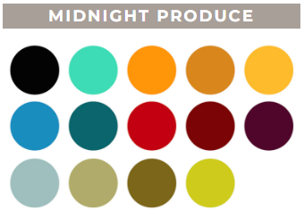
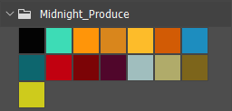

# Swatches to ASE

Convert Procreate Swatches files to ASE format (Adobe Swatch Exchange).

Can be used for importing Procreate palettes into Photoshop or other compatible programs like Illustrator or Affinity Designer.

## Example

Go to the `examples` folder to see some converted palettes like this one:

  
   
  <i>Source palette</i>

  
   
  <i>Converted palette imported in Photoshop</i>

## How to use

- Run `yarn` to install dependencies
- Add your swatches files in the "palette-import" folder
- Run `yarn run`
- The converted files should be in the `palette-export` folder.

### Extras

Run `yarn run-bw` to add black and white colors to the exported palettes.

## Credits

Source of the provided palettes:

https://bardotbrush.com/procreate-color-palettes/

### Libraries used

https://github.com/szydlovski/procreate-swatches
https://www.npmjs.com/package/color-convert
https://github.com/DominikGuzei/node-ase-utils
