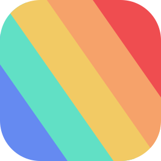
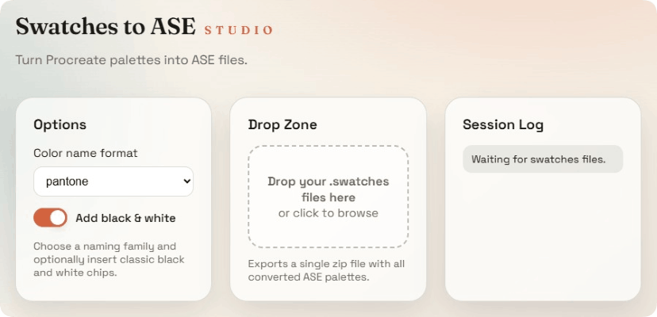
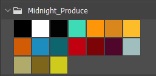

  

<h1 align="center">Swatches to ASE</h1>

  <strong>Convert Procreate palettes for Photoshop, Illustrator, and Affinity.</strong>
   
  <a href="https://joanroig.github.io/swatches-to-ase/"><strong>Open Web App</strong></a> • 
  <a href="https://github.com/joanroig/swatches-to-ase/releases"><strong>Download Desktop</strong></a>

  
  
  
  

---

  
  
Available for web, Windows, macOS, and Linux

## Example

Go to the `examples` folder to see some converted palettes like this one:

  
   
  <i>Source palette</i>

  
   
  <i>Converted palette imported in Photoshop</i>

## GUI (Web + Desktop)

The project now includes a cross-platform GUI that runs in the browser (GitHub
Pages compatible) and as a desktop app for Windows, macOS, and Linux.

### Web

- Install dependencies with `npm install`.
- Start the dev server with `npm run dev:web`.
- Build a static site with `npm run build:web` (output: `dist-web`).
- Preview the static build with `npm run preview:web`.
- Choose a color naming format, toggle black/white extras, then drag and drop `.swatches` files to download `swatches-ase.zip`.

### Desktop

- Run `npm run dev:desktop` to launch the Electron app with hot reload.
- Build the desktop bundle with `npm run build:desktop` (outputs: `dist-electron`, `dist-web`).
- Build installers with `npm run dist:desktop` (outputs: `release`).
- Desktop mode uses the same drag-and-drop workflow and saves a zip file.

## CLI

Be sure to have [Node.js](https://nodejs.org/en/download/) installed, then:

- [Download](https://github.com/joanroig/swatches-to-ase/archive/refs/heads/main.zip) or clone the repo.
- Run `npm install` in the root folder to install dependencies.
- Add your swatches files in the `palette-in` folder.
- Run `npm run convert` to convert the palettes.
- The converted files should be in the `palette-out` folder.

## Configuration (CLI)

The input/output folders, color naming, and optional black & white colors can be changed in: [config.json](config.json)

### Configuration parameters

- **inFolder:** folder used to read the swatches.
- **outFolder:** folder used to output the resulting ase files.
- **colorNameFormat:** sets the collection of color names to be used. Available namings are: _roygbiv, basic, html, x11, pantone, ntc_. See [color namer](https://github.com/colorjs/color-namer) for reference.
- **addBlackWhite:** if true, two extra colors will be added:

  
   
  <i>Converted palette with extra black and white colors imported in Photoshop</i>

## Credits

Source of the provided palettes:

https://bardotbrush.com/procreate-color-palettes/

### Libraries used

- https://github.com/szydlovski/procreate-swatches
- https://www.npmjs.com/package/color-convert
- https://github.com/colorjs/color-namer
- https://stuk.github.io/jszip/
