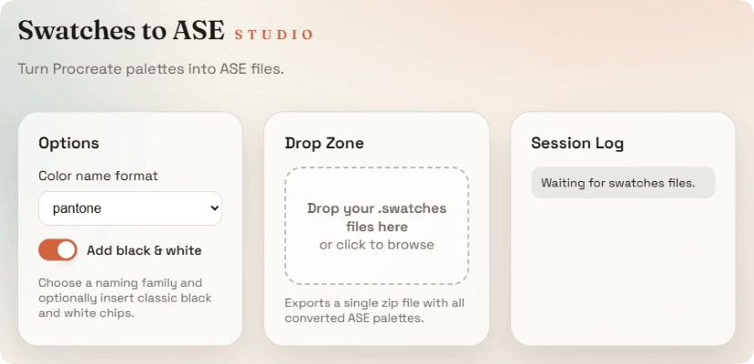
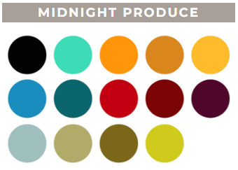
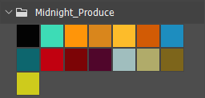
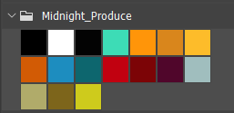

<p align="center">
  
</p>

<h1 align="center">Palette Studio</h1>

<p align="center">
  <strong>Import, edit, and export palettes across Procreate, Adobe, and GIMP formats.</strong>
  <br />
  <a href="https://palettes.web.app/"><strong>Open Web App</strong></a> •
  <a href="https://github.com/joanroig/palette-studio/releases"><strong>Download Desktop</strong></a>
</p>

<p align="center">
  <a href="https://nodejs.org/"></a>
  <a href="https://github.com/joanroig/palette-studio/actions/workflows/release.yml"></a>
  <a href="https://github.com/joanroig/palette-studio/actions/workflows/tests.yml"></a>
  <a href="https://github.com/joanroig/palette-studio/actions/workflows/deploy.yml"></a>
  <a href="https://palettes.web.app/"></a>
</p>

<br>

<p align="center">
  <a href="https://palettes.web.app/">
    
  </a>
  <br>
  <i>Available for web, Windows, macOS, and Linux</i>
</p>

<br>

## Highlights

- Import `.swatches`, `.ase`, and `.gpl` palettes.
- Generate palettes by style (analogous, complementary, triadic, etc.) with optional base colors.
- Edit colors, rename, reorder by drag-and-drop, and switch between HEX/RGB/HSB/HSL/CMYK/LAB views.
- Export single or batch palettes to ASE, Swatches, and GIMP GPL (zip downloads for multi-export).
- Quick exports for PNG, PDF, CSS variables, Tailwind config, SVG, JSON, and embed snippets.
- Share palettes via URL (Coolors, X, Pinterest) and import from shared links.
- Preferences and palettes are stored locally in the browser/desktop app.

## Example

Go to the `examples` folder to see some converted palettes like this one:

<p align="center">
  
  <br>
  <i>Source palette</i>
</p>

<p align="center">
  
  <br>
  <i>Converted palette imported in Photoshop</i>
</p>

## GUI (Web + Desktop)

The project now includes a cross-platform GUI that runs in the browser (Firebase
Hosting) and as a desktop app for Windows, macOS, and Linux.

### Web

- Install dependencies with `npm install`.
- Start the dev server with `npm run dev:web`.
- Build a static site with `npm run build:web` (output: `dist-web`).
- Preview the static build with `npm run preview:web`.
- Upload `.swatches`, `.ase`, or `.gpl` palette files.
- Generate new palettes, edit names/colors, and reorder swatches.
- Export single palettes or batch export as ASE/Swatches/GPL.
- Use quick exports for images, PDF, CSS, Tailwind, SVG, JSON, embed snippets, or share URLs.

### Deploy (Firebase Hosting)

Use the Firebase CLI to deploy the web build without GitHub Actions. The repo is
already configured for Hosting in `firebase.json` (public dir: `dist-web`).

1. Install the Firebase CLI once: `npm install -g firebase-tools`.
2. Authenticate: `firebase login`.
3. Link this repo to a Firebase project.
4. Build the web assets: `npm run build:web`.
5. Deploy Firestore rules and Hosting: `firebase deploy --only firestore:rules,hosting`.

Project linking options:

1. Create a local alias file: `firebase use --add` (creates `.firebaserc`).
2. Or deploy with an explicit project each time: `firebase deploy --project <PROJECT_ID> --only firestore:rules,hosting`.

Optional local preview:

1. Build the web assets: `npm run build:web`.
2. Serve the Hosting build locally: `firebase serve --only hosting`.

Multiple Hosting targets (staging/testing/production):

Use Firebase Hosting targets to map additional sites to this repo. Example for a production target:

```bash
firebase target:apply hosting production palettes
firebase deploy --only hosting:production
```

### Firebase Sync + Discovery (Free Tier)

Palette Studio can sync palettes between devices, publish public palettes, and
show a discovery feed using Firebase Auth + Firestore (Spark/free tier).

1. Create a Firebase project (Spark plan) and add a Web app.
2. Enable Authentication → Sign-in method → Google (and optionally add your
   support email).
3. Create a Firestore database in production mode.
4. Copy the Firebase config into `web/.env` using `web/.env.example` as a guide:
   ```
   VITE_FIREBASE_API_KEY=...
   VITE_FIREBASE_AUTH_DOMAIN=...
   VITE_FIREBASE_PROJECT_ID=...
   VITE_FIREBASE_APP_ID=...
   VITE_FIREBASE_STORAGE_BUCKET=...
   VITE_FIREBASE_MESSAGING_SENDER_ID=...
   VITE_FIREBASE_APP_CHECK_KEY=... (optional)
   ```
5. Restart the dev server or rebuild the app.

**Optional: GitHub Actions secrets**
Add the same `VITE_FIREBASE_*` keys as repository secrets to ensure builds
deploy with Firebase enabled (for hosting and releases).

The deployment workflow also requires a `FIREBASE_SERVICE_ACCOUNT` repository
secret containing the complete JSON key for a service account with Firebase
Hosting Admin and Firebase Rules Admin access to the project.

**Recommended Firestore rules**
Use rules that only allow authenticated users to read/write their own sync document, and allow public palettes to be read by anyone while restricting writes to their owners. The repo now includes a hardened baseline in `firestore.rules` with per-user access, size limits, and simple rate limits.

Deploy `firestore.rules` before shipping a client whose sync payload has changed: `firebase deploy --only firestore:rules`. The GitHub deployment workflow does this before publishing Hosting; its service account therefore needs the Firebase Rules Admin role (`roles/firebaserules.admin`) in addition to its Hosting permissions.

### Android (Capacitor)

Palette Studio can be wrapped as an Android app using Capacitor:

1. Build the web app: `npm run build:web`
2. Add Android once: `npx cap add android`
3. Sync web assets: `npm run build:android`
4. Open Android Studio: `npm run open:android`

Be sure to register the Android app in Firebase and add the generated
`google-services.json` to the Android project when you enable sync.

### Firebase security and key restrictions

To ensure only this app can talk to Firebase:

- **Restrict API keys** in Google Cloud Console → APIs & Services → Credentials.
  - For web: restrict HTTP referrers to your production domains.
  - For Android: restrict by package name and SHA-1 certificate fingerprints.
- **Enable App Check** with reCAPTCHA v3 (web) and Play Integrity (Android) to stop unauthorized clients.
  - Web uses `VITE_FIREBASE_APP_CHECK_KEY` (reCAPTCHA v3 site key).
  - Electron/desktop needs a custom App Check provider if you plan to enforce App Check on Firestore.
- **Lock down Firestore rules** (see above) and avoid public write access.
- **Rotate keys** if you suspect leakage and keep `.env` out of version control.

### Desktop

- Run `npm run dev:desktop` to launch the Electron app with hot reload.
- Build the desktop bundle with `npm run build:desktop` (outputs: `dist-electron`, `dist-web`).
- Build installers with `npm run dist:desktop` (outputs: `release`).
- Desktop mode uses the same drag-and-drop workflow and saves zip exports via a native dialog.

**Code signing (recommended)**
Configure CI signing secrets so releases are signed on Windows/macOS:
- Windows: `WIN_CSC_LINK`, `WIN_CSC_KEY_PASSWORD`
- macOS: `MAC_CSC_LINK`, `MAC_CSC_KEY_PASSWORD`, `APPLE_ID`, `APPLE_APP_SPECIFIC_PASSWORD`, `APPLE_TEAM_ID`

## CLI

Be sure to have [Node.js](https://nodejs.org/en/download/) 22+ installed, then:

- [Download](https://github.com/joanroig/palette-studio/archive/refs/heads/main.zip) or clone the repo.
- Run `npm install` in the root folder to install dependencies.
- Add your palette files (`.swatches`, `.ase`, `.gpl`) in the `palette-in` folder.
- Run `npm run convert` to convert the palettes into the formats you choose.
- The converted files should be in the `palette-out` folder.

## Configuration (CLI)

The input/output folders, color naming, and optional black & white colors can be changed in: [config.json](config.json)

### Configuration parameters

- **inFolder:** folder used to read the palette files.
- **outFolder:** folder used to output the converted palettes.
- **outFormats:** output formats as an array or comma-separated string. Use `ase`, `swatches`, `gpl`, or `all`. Defaults to `ase`.
- **colorNameFormat:** sets the collection of color names to be used. Available namings are: _roygbiv, basic, html, x11, pantone, ntc_. See [color namer](https://github.com/colorjs/color-namer) for reference.
- **addBlackWhite:** if true, two extra colors will be added:

<p align="center">
  
  <br>
  <i>Converted palette with extra black and white colors imported in Photoshop</i>
</p>

## Tests

- Run unit tests with `npm test`.
- Run coverage with `npm run test:coverage`.
- Run GUI tests with `npm run test:gui` (installs Playwright as needed).

## Credits

Source of the provided palettes:

https://bardotbrush.com/procreate-color-palettes/

### Libraries used

- https://github.com/szydlovski/procreate-swatches
- https://www.npmjs.com/package/color-convert
- https://github.com/colorjs/color-namer
- https://stuk.github.io/jszip/
